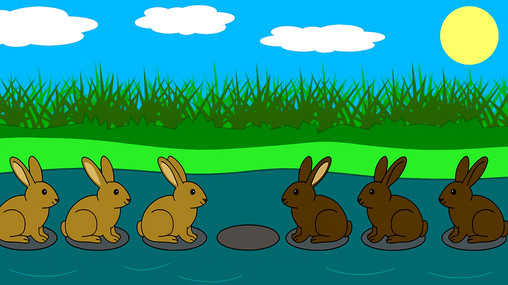

# PROBLEM 1 : RABBIT LEAP

**In the rabbit leap problem, three east-bound rabbits stand in a line blocked by three west-bound rabbits. They are crossing a stream with stones placed in the east west direction in a line. There is one empty stone between them. 
 Rabbits waiting to cross. Each rabbit can jump over one, but not more than that. How can they avoid getting into a deadlock? 
 The rabbits can only move forward one step or two steps. They can jump over one rabbit if the need arises, but not more than that. Are they smart enough to cross each other without having to step into the water? Draw the state space for solving the problem, and find the solution path in the state space graph.**

## PROBLEM DESCRIPTION:

Three rabbits are in the east trying to move move towards west and other three are in the west trying to move towards west.

They all are standing on the stones in a straight line with one stone empty between the rabbits in the east and rabbits in the west.

They can :
- Move forward  by 1 step into empty stone
- Jump over one rabbit if there's a empty stone just beyond it

All the rabbits in the east have to move west and rabbits present in the west to east.

## APPROACH :
Let us consider the inital state as 
> ['E', 'E', 'E', '_', 'W', 'W', 'W']

- 'E' is considered as rabbits on the east, 'W' as rabbits in the west and '_' as empty stone.

Our final goal state is
> ['W', 'W', 'W', '_', 'E', 'E', 'E']

Consider the array as a state
create a **State class**
to make the transitions in the state.

**State Representation**
- Each stone is represented as one of the following characters:
   - `'E'`: East-bound rabbit
   - `'W'`: West-bound rabbit
   - `'_'`: Empty stone

**Goal Test**
- Check if the state is goal state or not

**Move Generations**
- Generate the next possible states by the moving the rabbits forward or jump over the rabbit.

**Search Algorithms**
- **Breath First Search (BFS)**
    
    check for the goal state. If it is the goal state then print the path.
    If not, generate the next possible states from the current state.

 - You can also use the Depth First Search (DFS) for the same question.

---

# PROBLEM 2 : BRIDGE CROSSING

**Amogh, Ameya and their grandparents have to cross a bridge over the river within one hour to catch a train. It is raining and they have only one umbrella which can be shared by two people. Assuming that no one wants to get wet, how can they get across in an hour or less? Amogh can cross the bridge in 5 minutes, Ameya in 10, their grandmother in 20, and their grandfather in 25. Design a search algorithm to answer the question.**

### Bridge Crossing Problem with Umbrella 
## PROBLEM DESCRIPTION:

There are the four people Amogh, Ameya, Grand mother and Grand father. They have to **cross the bridge with one umbrella within 60 minutes**, and It's raining. Each person walks at a **different speed** and no one wants to get wet!

**People**:  
  - Amogh – 5 minutes  
  - Ameya – 10 minutes  
  - Grandmother – 20 minutes  
  - Grandfather – 25 minutes 

**Constraints**:
  - Only **two people** can cross the bridge at a time.
  - They **must carry the umbrella** while crossing.
  - Everyone must be on the other side in **60 minutes or less**.
  - No one wants to get wet, so **the umbrella must be used at all times**.

**Goal :**
- Move all four individuals from the starting side to the other side of the bridge using the umbrella, such that the **total time taken ≤ 60 minutes**.

## APPROACH :
Let us consider the inital state as 
> ['E', 'E', 'E', 'E']

- 'E' is considered as person is in the east side of the bridge.

Our final goal state is
> ['W', 'W', 'W', 'W']

Consider the array as a state
create a **State class**
to make the transitions in the state.

**State Representation**
- `state`: A list representing positions of each person (`E` for start side, `W` for end side).
- `umbrella_pos`: Position of the umbrella (`E` or `W`).
- `required_times`: Time taken by each person to cross.
- `time_taken`: Total time elapsed for the sequence of moves so far.

**Goal Test**
- Check if the state is goal state or not

**Move Generations**
- Allows **1 or 2 people** to cross **only if the umbrella is on their side**.
- For each move, calculates the **updated state and time taken**.

**State Filtering**
- Ensures generated states:
  - Are not already explored.
  - Have `time_taken <= 60`.

**Search Algorithms**
- **Breath First Search (BFS)**
    
    check for the goal state. If it is the goal state then print the path.
    If not, generate the next possible states from the current state.

 - You can also use the Depth First Search (DFS) for the same question.

---

# Conclusion
**These problems are classic examples of state space search, where each state represents a configuration, and search algorithms like BFS and DFS help find valid paths to the goal under given constraints.**

---